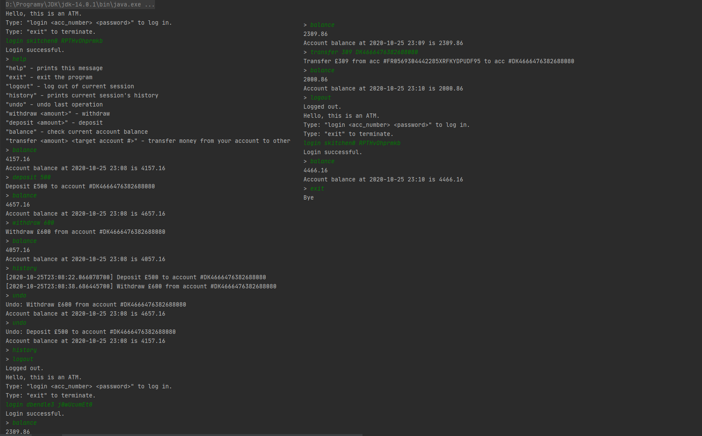

# Cashpoint

## Description
Cashpoint is a terminal application. It was created during my study at Java Software Development Bootcamp as a fun project. 

The app is using two CSV files: 

* users.csv - store login, password and acc number.
* accounts.csv - store acc number and account balance.

### Functionality:

1.  At launch, two CSV files load automatically. 
2. To start using cashpoint, you need to first log in with user login and password. 
3. Each user has a history of actions from the session. Each session starts when the user logs in and finish when the user logs out.
4. Logged user can undo operations from the current session. 
5. User has a list of actions:
- Help
- Withdraw
- Deposit
- Exit
- Transfer
- Undo
- Balance

 Application prevent users from fraudulent actions like: 

- Withdraw/transfer extra money
- Transfer money into a nonexistent account

### Technologies used:

- JUnit 5
- Java 11

### Example Session:

